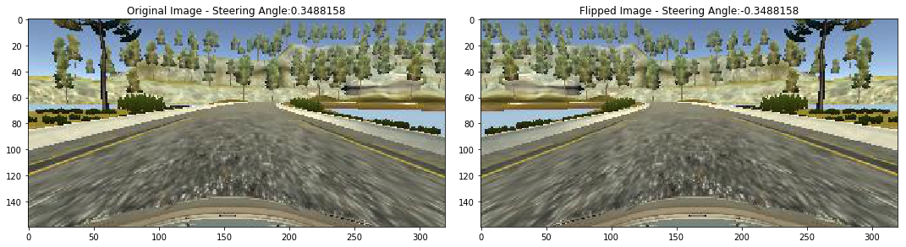
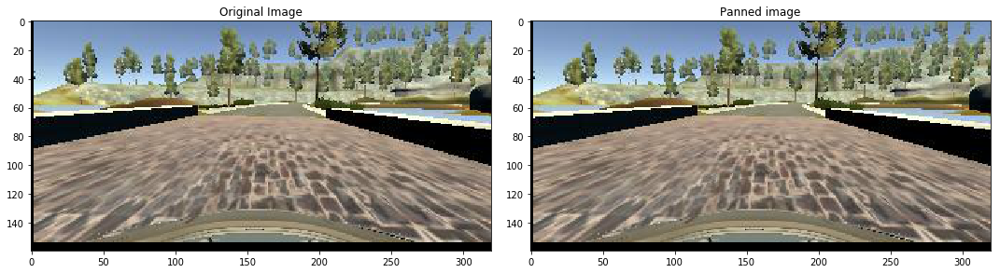
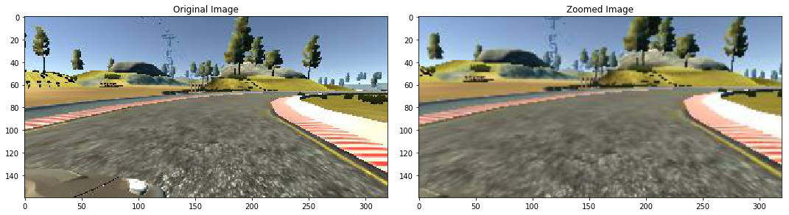
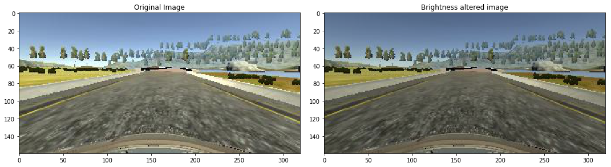

# **Behavioral Cloning** 


---

**Behavioral Cloning Project**

The goals / steps of this project are the following:
* Use the simulator to collect data of good driving behavior
* Build, a convolution neural network in Keras that predicts steering angles from images
* Train and validate the model with a training and validation set
* Test that the model successfully drives around track one without leaving the road
* Summarize the results with a written report


[//]: # (Image References)

[image1]: ./examples/placeholder.png "Model Visualization"
[image2]: ./examples/placeholder.png "Grayscaling"
[image3]: ./examples/placeholder_small.png "Recovery Image"
[image4]: ./examples/placeholder_small.png "Recovery Image"
[image5]: ./examples/placeholder_small.png "Recovery Image"
[image6]: ./examples/placeholder_small.png "Normal Image"
[image7]: ./examples/placeholder_small.png "Flipped Image"

## Rubric Points
### Here I will consider the [rubric points](https://review.udacity.com/#!/rubrics/432/view) individually and describe how I addressed each point in my implementation.  

---
### Files Submitted & Code Quality

#### 1. Submission includes all required files and can be used to run the simulator in autonomous mode

My project includes the following files:
* behavioural_cloning.ipynb containing the script to create and train the model
* drive.py for driving the car in autonomous mode
* model.h5 containing the nvidia model
* writeup.md summarizing the results
* video of car driving around track using model can be found at: https://youtu.be/QSBr1DsTNjU

#### 2. Submission includes functional code
Using the Udacity provided simulator and my drive.py file, the car can be driven autonomously around the track by executing 
```sh
python drive.py model.h5
```

#### 3. Submission code is usable and readable

The model.py file contains the code for training and saving the convolution neural network. The file shows the pipeline I used for training and validating the model, and it contains comments to explain how the code works.

### Model Architecture and Training Strategy

#### 1. An appropriate model architecture has been employed

My model consists of a convolution neural network with 3x3 filter sizes and depths between 32 and 128 (model.py lines 18-24) 

The model includes ELU layers to introduce nonlinearity (code line 20), and the data is normalized in the model using a Keras lambda layer (code line 18). 


#### 3. Model parameter tuning

The model used an adam optimizer, so the learning rate was not tuned manually (model.py line 25).


### Model Architecture and Training Strategy

#### 1. Solution Design Approach
The nvidia model was used as a suggestion from a Udemy course I was taking.
In order to gauge how well the model was working, I split my image and steering angle data into a training and validation set. I found that my first model had a low mean squared error on the training set but a high mean squared error on the validation set. This implied that the model was overfitting. 

To combat the overfitting, I modified the model to include dropout layers, but after some experimentation the model seemed to do better without dropout layers so I removed them.

The final step was to run the simulator to see how well the car was driving around track one.

#### 2. Final Model Architecture

The final model architecture consisted of 5 convolutional layers a flattening layer and then another 4 dense layers. This is the nvidia model.


#### 3. Creation of the Training Set & Training Process

I have used the sample data provided by udacity. For better generalizability I could have used the simulator provided by Udacity to gather more data by driving two laps and another two laps backward in the given track. As well as recording a few recovery laps.

To augment the data sat, I also flipped images and angles thinking that this would improve the generalizability of the model. For example, here is an image that has then been flipped:




After the collection process, I had 8036 number of data points. I then preprocessed this data by removing a lot of images with forward bias. As you can see in the bar plot below there a high bias for the car to move in a straight line. This could heavily impact training and make the model unable to deal with curved lanes, so I had to remove a lot of images from the collection set


In addition to flipping the images I also use panned the images.


And zoomed into relevant bits of the image.


and finally altered the brightness.


All these alterations help with the generalizability fo the model.


I finally randomly shuffled the data set and put 20% of the data into a validation set. 

I used this training data for training the model. The validation set helped determine if the model was over or under fitting. I used an adam optimizer so that manually training the learning rate wasn't necessary.

